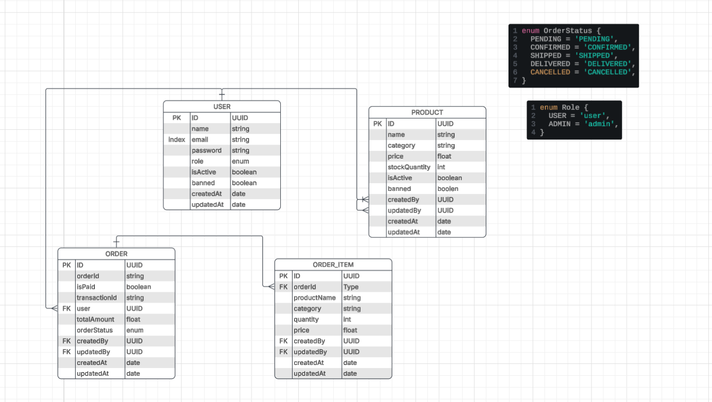

# Order Management System (OMS)

A robust, scalable, and secure Order Management System built with NestJS, featuring JWT authentication, role-based access control, advanced filtering, and a custom human-readable Order ID generation algorithm.


## 📋 Table of Contents

- [Project Structure](#-project-structure)
- [Features](#-features)
- [Prerequisites](#-prerequisites)
- [Installation & Setup](#-installation--setup)
- [Database Schema](#-database-schema)
- [API Documentation](#-api-documentation)
- [Order ID Generation Algorithm](#-order-id-generation-algorithm)
- [Architectural Decisions](#-architectural-decisions)
- [Environment Variables](#-environment-variables)

---

## Project Structure

```text
OMS/
├── .github/workflows/ci.yml
├── database/                  # SQL schema and migration files
├── dist/                      # Compiled JavaScript output (generated)
├── logs/                      # Application log files (generated)
├── node_modules/              # Dependencies (generated)
├── src/
│   ├── common/                # Shared reusable code
│   │   ├── decorators/        # Custom decorators (@Roles, @Public, etc.)
│   │   ├── dto/               # Shared DTOs (Pagination, PageRequest)
│   │   ├── enums/             # Shared enums (Role)
│   │   ├── guards/            # Global guards (JwtAuthGuard)
│   │   └── interceptor/       # Logging interceptor
│   ├── config/                # Application configuration
│   │   ├── configuration.ts
│   │   ├── database.config.ts
│   │   └── env.config.ts
│   ├── constants/             # Global constants
│   │   └── project.constant.ts
│   ├── database/              # Database module configuration
│   │   └── database.module.ts
│   ├── exceptions/            # Custom exception classes
│   ├── modules/               # Feature modules
│   │   ├── auth/              # Authentication (Login, Register, JWT)
│   │   ├── order/             # Order processing & Custom ID generation
│   │   ├── product/           # Product catalog management
│   │   ├── seeder/            # Database seeding for development
│   │   └── user/              # User management
│   ├── app.controller.spec.ts
│   ├── app.controller.ts
│   ├── app.module.ts          # Root application module
│   ├── app.service.ts
│   └── main.ts                # Application entry point
├── test/                      # E2E tests
├── .env                       # Environment variables
├── .gitignore
├── Makefile
├── docker-compose.yaml
├── .prettierrc
├── eslint.config.mjs
├── nest-cli.json
└── README.md
```

## Features

- **JWT Authentication** with role-based access control (Admin/User)
- **Product Management** with real-time stock tracking and validation
- **Order Processing** with automatic stock reduction and transaction safety
- **Custom Order ID Generation** (Human-readable, unique, and sequential)
- **Concurrency Control** using Database Transactions and Pessimistic Locking(For avoiding negetive stock)
- **Advanced Filtering & Pagination** using the Specification Pattern
- **Comprehensive Logging** using Winston
- **Auto-generated Swagger Documentation**
- **Database Seeder** for rapid development setup

---

## 📦 Prerequisites

- **Node.js** (v18 or higher)
- **PostgreSQL** (v14 or higher)
- **npm** or **yarn**
- **Git**

---

## 🚀 Installation & Setup

### 1. Clone the Repository

```sh
git clone https://github.com/mostafizur-raahman/Order-Management-System.git
cd Order-Management-System
npm install
```

## Database Schema

#### Relationship

```js
Relationships Shown:
USER → ORDER (One-to-Many)
ORDER → ORDER_ITEM (One-to-Many)
USER → PRODUCT (One-to-Many, via createdBy/updatedBy)
```

```js
If you prefer to use the raw SQL schema instead of TypeORM synchronization:
psql -U postgres -h localhost or database server
\c order_management_system
\i `your_pwd`/database/schema.sql

```



## 📚 API Documentation

**Base URL:** `http://localhost:3000/api/v1` _(Assuming `API_PREFIX` is `/api/v1`)_
**Authentication:** All endpoints require the header `Authorization: Bearer <JWT_TOKEN>`.

### 👤 Users Module

| Method   | Endpoint     | Description           | Access | Parameters / Body                                            |
| :------- | :----------- | :-------------------- | :----- | :----------------------------------------------------------- |
| `GET`    | `/users`     | Search & filter users | Admin  | **Query:** `id`, `name`, `email`, `isActive`, `page`, `size` |
| `GET`    | `/users/:id` | Get user by ID        | Admin  | **Path:** `id`                                               |
| `POST`   | `/users`     | Create a new user     | Admin  | **Body:** `CreateUserDto`                                    |
| `PATCH`  | `/users/:id` | Update user details   | Admin  | **Path:** `id`, **Body:** `UpdateUserDto`                    |
| `DELETE` | `/users/:id` | Delete a user         | Admin  | **Path:** `id`                                               |

### 📦 Products Module

| Method   | Endpoint           | Description              | Access      | Parameters / Body                                                                        |
| :------- | :----------------- | :----------------------- | :---------- | :--------------------------------------------------------------------------------------- |
| `GET`    | `/products`        | Search & filter products | Admin, User | **Query:** `id`, `name`, `category`, `minPrice`, `maxPrice`, `searchKey`, `page`, `size` |
| `GET`    | `/products/:id`    | Get product by ID        | Admin, User | **Path:** `id`                                                                           |
| `POST`   | `/products/create` | Create a new product     | Admin       | **Body:** `CreateProductDto`                                                             |
| `PATCH`  | `/products/:id`    | Update product details   | Admin       | **Path:** `id`, **Body:** `UpdateProductDto`                                             |
| `DELETE` | `/products/:id`    | Delete a product         | Admin       | **Path:** `id`                                                                           |

### Orders Module

| Method  | Endpoint             | Description                 | Access      | Parameters / Body                                                                                               |
| :------ | :------------------- | :-------------------------- | :---------- | :-------------------------------------------------------------------------------------------------------------- |
| `POST`  | `/orders/create`     | Create a new order          | Admin, User | **Body:** `CreateOrderDto`                                                                                      |
| `GET`   | `/orders/my-orders`  | Get logged-in user's orders | Admin, User | **Query:** `orderId`, `status`, `isPaid`, `searchKey`, `page`, `size`                                           |
| `GET`   | `/orders`            | Get all orders (Admin view) | Admin       | **Query:** `id`, `orderId`, `status`, `isPaid`, `userId`, `minAmount`, `maxAmount`, `searchKey`, `page`, `size` |
| `GET`   | `/orders/:id`        | Get order by ID             | Admin, User | **Path:** `id`                                                                                                  |
| `PATCH` | `/orders/:id/status` | Update order status         | Admin       | **Path:** `id`, **Body:** `UpdateOrderStatusDto`                                                                |
| `PATCH` | `/orders/:id/cancel` | Cancel an order             | Admin, User | **Path:** `id`                                                                                                  |

                              |

## 🔢 Order ID Generation Algorithm

**Format:** `[CATEGORY]-[USER]-[YYMMDD]-[SEQ]`  
**Example:** `ELE-9844-260703-0001`

### Why It's Unique

The ID combines four independent factors, making collisions mathematically impossible:

- **Category Prefix:** 3-letter code from the first product (e.g., `ELE`)
- **User Identifier:** First 4 characters of the customer's UUID (e.g., `9844`)
- **Date Isolation:** `YYMMDD` format guarantees uniqueness per day
- **Atomic Sequence:** Sequential counter (`0001`, `0002`) scoped to the exact category+user+day

### Uniqueness Guarantees

- **Row-Level Locking:** `SELECT ... FOR UPDATE` blocks concurrent reads during sequence generation
- **Atomic Transactions:** ID creation and stock deduction run in a single DB transaction
- **Hard Constraint:** `UNIQUE` database index on `order_id` physically prevents duplicates
- **Daily Reset:** Counter automatically restarts at `0001` when the date changes

### 📊 Maximum Orders Per User

Based on the 4-digit sequence (`0001` to `9999`), the limits are:

- **Per Category, Per Day:** **9,999 orders** (e.g., 9,999 Electronics orders on July 3rd).
- **Per Day (All Categories):** **9,999 × Total Categories** (e.g., if you have 5 categories, 49,995 orders/day).
- **Lifetime:** **Unlimited** (the counter resets daily).

### What if you hit 9,999?

Simply increase the padding in the code from 4 to 5 or 6 digits:

```typescript
// Current (Max 9,999)
const sequence = (count + 1).toString().padStart(4, '0');

// Scaled up (Max 999,999)
const sequence = (count + 1).toString().padStart(6, '0');
```

## Architectural Decisions

- **Concurrency & Stock Integrity:** Unlike Go or Java, which feature built-in concurrency and locking mechanisms, Node.js is single-threaded and lacks native row-locking. To prevent race conditions and negative stock during high-concurrency checkouts, I implemented **Database Pessimistic Locking** within atomic transactions. This physically locks product rows at the database level, forcing concurrent requests to queue safely.

- **Dynamic Querying (Specification Pattern):** Replaced complex conditional filtering with the Specification Pattern. This cleanly separates SQL query logic from business logic, making filters modular, reusable, and highly testable.

- **Historical Data Accuracy (Snapshot Pattern):** Order items store the product name, category, and price at the exact moment of purchase. This ensures historical financial records remain 100% accurate, even if the product is later updated or deleted from the catalog.

- **Security (RBAC):** Enforced strict access boundaries using global JWT authentication combined with Role-Based Access Control (RBAC) decorators, ensuring only authorized admins can perform sensitive operations.

- **Operational Efficiency (Custom Order IDs):** Replaced standard UUIDs with a custom, multi-factor Order ID algorithm (Category-User-Date-Sequence). This generates human-readable, collision-resistant IDs that are much easier for users and support staff to track.

## Environment Variables
